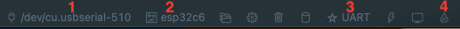

# esp32c6 zigbee demo

Simple demo to use zigbee on esp32c6, works with Home Assistant and [Zigbee Home Automation](https://www.home-assistant.io/integrations/zha)

Tested with [Sonoff Zigbee 3.0 USB Dongle Plus-P](https://sonoff.tech/product/gateway-and-sensors/sonoff-zigbee-3-0-usb-dongle-plus-p/) coordinator.

## Installation

- Make sure [prerequisites](https://docs.espressif.com/projects/esp-idf/en/v4.2.3/esp32/get-started/index.html) for ESP-IDF are fullfilled.
- Install VSCode and [ESP-IDF Visual Studio Code Extension](https://docs.espressif.com/projects/esp-idf/en/v4.2.3/esp32/get-started/vscode-setup.html)
- Clone the repo

## Flash on the esp32c6

1. Select your serial port
2. Select esp32c6
3. Select UART
4. Build, flash and monitor
